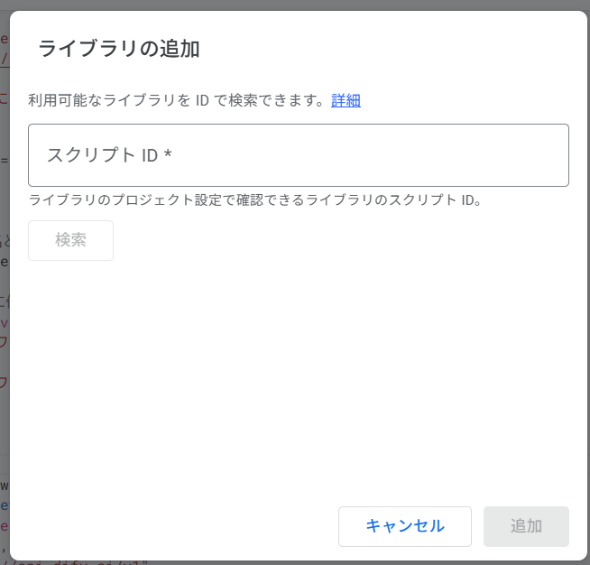

# DAS (Dify Application Script)

Google Apps Script（GAS）から Dify API を簡単に呼び出すための JavaScript ライブラリです。

## 📋 目次

- [概要](#概要)
- [特徴](#特徴)
- [導入方法](#導入方法)
- [基本的な使い方](#基本的な使い方)
- [クラス別使用例](#クラス別使用例)
- [API リファレンス](#apiリファレンス)
- [設定とセキュリティ](#設定とセキュリティ)
- [トラブルシューティング](#トラブルシューティング)
- [開発者向け情報](#開発者向け情報)

## 概要

DAS（Dify Application Script）は、Google Apps Script 環境で Dify API の全機能を簡単に利用できるように設計されたライブラリです。Chatbot、Chatflow、Workflow、TextGenerator の 4 つの主要な Dify アプリケーション形式に対応しています。

## 特徴

- ✅ **全 Dify API 対応**: Chatbot、Chatflow、Workflow、TextGenerator
- ✅ **型安全**: 詳細な JSDoc による型定義
- ✅ **エラーハンドリング**: 豊富なエラー処理とログ機能
- ✅ **キャッシュ機能**: API レスポンスの自動キャッシュ
- ✅ **レート制限対応**: 自動リトライ機能
- ✅ **ファイルアップロード**: 画像・音声・文書ファイル対応
- ✅ **ストリーミング**: リアルタイム応答対応
- ✅ **音声機能**: 音声からテキスト、テキストから音声

## 導入方法

### 1. Apps Script プロジェクト作成

1. [Google Apps Script](https://script.google.com/) にアクセス
2. 「新しいプロジェクト」をクリック
3. プロジェクト名を「DAS-Project」等に変更

### 2. DAS ライブラリのコード追加

2-1

1. `das-unified-classes.js` の内容をコピー
2. Apps Script エディタで「ファイル」→「新規」→「スクリプト」
3. `das-unified-classes.js` にリネーム
4. コピーしたコードを貼り付けて保存

または
2-2. (推奨)

1. ライブラリ → スクリプト ID に
   ｢1oCUfyTJyUe2YMGtbns7VXn78b7mjcaVq6XMyS6jaFE4KIEKqTHbew5rT｣を入力し検索
2. ID を使いやすい名前(例：DAS)に変更して追加。



### 3. API キーの設定

```javascript
// スクリプトエディタでAPI キーを設定
function setupApiKeys() {
  const properties = PropertiesService.getScriptProperties();

  // Chatbot用
  properties.setProperty("DIFY_CHATBOT_API_KEY", "your-chatbot-api-key");

  // Chatflow用
  properties.setProperty("DIFY_CHATFLOW_API_KEY", "your-chatflow-api-key");

  // Workflow用
  properties.setProperty("DIFY_WORKFLOW_API_KEY", "your-workflow-api-key");

  // TextGenerator用
  properties.setProperty("DIFY_TEXTGEN_API_KEY", "your-textgen-api-key");
}
```

## 基本的な使い方

### 初期化

各クラスは以下のように初期化します：

```javascript
// Chatbot
const chatbot = new Chatbot({
  apiKey: PropertiesService.getScriptProperties().getProperty(
    "DIFY_CHATBOT_API_KEY"
  ),
  user: "user-123",
  baseUrl: "https://api.dify.ai/v1", // オプション
});

// Chatflow
const chatflow = new Chatflow({
  apiKey: PropertiesService.getScriptProperties().getProperty(
    "DIFY_CHATFLOW_API_KEY"
  ),
  user: "user-123",
});

// Workflow
const workflow = new Workflow({
  apiKey: PropertiesService.getScriptProperties().getProperty(
    "DIFY_WORKFLOW_API_KEY"
  ),
  user: "user-123",
});

// TextGenerator
const textGenerator = new Textgenerator({
  apiKey: PropertiesService.getScriptProperties().getProperty(
    "DIFY_TEXTGEN_API_KEY"
  ),
  user: "user-123",
});
```

ライブラリの場合、

```Javascript
// Chatbot
const chatbot = DAS.getChatbot({
  apiKey: PropertiesService.getScriptProperties().getProperty(
    "DIFY_CHATBOT_API_KEY"
  ),
  user: "user-123",
  baseUrl: "https://api.dify.ai/v1", // オプション
});

// Chatflow
const chatflow = DAS.getChatflow({
  apiKey: PropertiesService.getScriptProperties().getProperty(
    "DIFY_CHATFLOW_API_KEY"
  ),
  user: "user-123",
});

// Workflow
const workflow = DAS.getWorkflow({
  apiKey: PropertiesService.getScriptProperties().getProperty(
    "DIFY_WORKFLOW_API_KEY"
  ),
  user: "user-123",
});

// TextGenerator
const textGenerator = DAS.getTextgenerator({
  apiKey: PropertiesService.getScriptProperties().getProperty(
    "DIFY_TEXTGEN_API_KEY"
  ),
  user: "user-123",
});
```

## クラス別使用例

### 🤖 Chatbot

```javascript
function chatbotExample() {
  const chatbot = new Chatbot({
    apiKey: PropertiesService.getScriptProperties().getProperty(
      "DIFY_CHATBOT_API_KEY"
    ),
    user: "user-123",
  });

  // メッセージ送信
  const response = chatbot.sendMessage("こんにちは！", "user-123", {
    responseMode: "blocking", // blocking または streaming
    conversationId: null, // 新しい会話の場合はnull
  });

  Logger.log("AI応答:", response.answer);
  Logger.log("会話ID:", response.conversation_id);

  // 会話履歴取得
  const conversations = chatbot.getConversations("user-123");
  Logger.log("会話一覧:", conversations);
}
```

### 🔄 Chatflow

```javascript
function chatflowExample() {
  const chatflow = new Chatflow({
    apiKey: PropertiesService.getScriptProperties().getProperty(
      "DIFY_CHATFLOW_API_KEY"
    ),
    user: "user-123",
  });

  // メッセージ送信
  const response = chatflow.sendMessage(
    "データ分析をお願いします",
    "user-123",
    {
      inputs: {
        dataset: "sales_data_2024",
      },
    }
  );

  Logger.log("分析結果:", response.answer);
}
```

### ⚡ Workflow

```javascript
function workflowExample() {
  const workflow = new Workflow({
    apiKey: PropertiesService.getScriptProperties().getProperty(
      "DIFY_WORKFLOW_API_KEY"
    ),
    user: "user-123",
  });

  // ワークフロー実行
  const response = workflow.runWorkflow(
    {
      inputs: {
        text: "要約してください：長い文章...",
        language: "ja",
      },
      responseMode: "blocking",
    },
    "user-123"
  );

  Logger.log("ワークフロー結果:", response.data.outputs);
}
```

### 📝 TextGenerator

```javascript
function textGeneratorExample() {
  const textGenerator = new Textgenerator({
    apiKey: PropertiesService.getScriptProperties().getProperty(
      "DIFY_TEXTGEN_API_KEY"
    ),
    user: "user-123",
  });

  // テキスト生成
  const response = textGenerator.createCompletion(
    {
      inputs: {
        topic: "AI技術の未来",
        length: "medium",
      },
      responseMode: "blocking",
    },
    "user-123"
  );

  Logger.log("生成されたテキスト:", response.answer);
}
```

### 🎵 音声機能

```javascript
// 音声からテキスト
function audioToTextExample() {
  const chatbot = new Chatbot({
    apiKey: PropertiesService.getScriptProperties().getProperty(
      "DIFY_CHATBOT_API_KEY"
    ),
    user: "user-123",
  });

  const audioFile = DriveApp.getFilesByName("sample.m4a").next();
  const audioBlob = audioFile.getBlob().setContentType("audio/m4a");

  const response = chatbot.audioToText(audioBlob);
  Logger.log("音声認識結果:", response.text);
}

// テキストから音声
function textToAudioExample() {
  const textGenerator = new Textgenerator({
    apiKey: PropertiesService.getScriptProperties().getProperty(
      "DIFY_TEXTGEN_API_KEY"
    ),
    user: "user-123",
  });

  const audioBlob = textGenerator.textToAudio({
    text: "こんにちは、音声合成のテストです",
  });

  // Driveに保存
  audioBlob.setName(`speech_${new Date().getTime()}.wav`);
  const file = DriveApp.createFile(audioBlob);
  Logger.log("音声ファイル作成:", file.getUrl());
}
```

### 📎 ファイルアップロード

```javascript
function fileUploadExample() {
  const chatbot = new Chatbot({
    apiKey: PropertiesService.getScriptProperties().getProperty(
      "DIFY_CHATBOT_API_KEY"
    ),
    user: "user-123",
  });

  // Driveからファイル取得
  const file = DriveApp.getFilesByName("document.pdf").next();
  const fileBlob = file.getBlob();

  // ファイルアップロード
  const uploadResponse = chatbot.uploadFile(fileBlob, "user-123");
  Logger.log("アップロード完了:", uploadResponse.id);

  // アップロードしたファイルを使ってメッセージ送信
  const response = chatbot.sendMessage(
    "このファイルの内容を要約してください",
    "user-123",
    {
      files: [
        {
          type: "upload_file",
          uploadFileId: uploadResponse.id,
        },
      ],
    }
  );

  Logger.log("ファイル分析結果:", response.answer);
}
```

## API リファレンス

### 共通メソッド（全クラス）

| メソッド                 | 説明                         | パラメータ                   |
| ------------------------ | ---------------------------- | ---------------------------- |
| `getAppInfo()`           | アプリケーション基本情報取得 | なし                         |
| `getAppParameters()`     | パラメータ情報取得           | なし                         |
| `getAppMeta()`           | メタ情報取得                 | なし                         |
| `uploadFile(file, user)` | ファイルアップロード         | `file`: Blob, `user`: string |

### Chatbot / Chatflow 専用メソッド

| メソッド                                     | 説明                | パラメータ                                         |
| -------------------------------------------- | ------------------- | -------------------------------------------------- |
| `sendMessage(query, user, options)`          | メッセージ送信      | `query`: string, `user`: string, `options`: object |
| `getConversations(user, options)`            | 会話一覧取得        | `user`: string, `options`: object                  |
| `getConversationMessages(id, user, options)` | 会話履歴取得        | `id`: string, `user`: string, `options`: object    |
| `renameConversation(id, name, user)`         | 会話名変更          | `id`: string, `name`: string, `user`: string       |
| `deleteConversation(id, user)`               | 会話削除            | `id`: string, `user`: string                       |
| `audioToText(audioFile)`                     | 音声 → テキスト変換 | `audioFile`: Blob                                  |

### Workflow 専用メソッド

| メソッド                               | 説明             | パラメータ                              |
| -------------------------------------- | ---------------- | --------------------------------------- |
| `runWorkflow(data, user)`              | ワークフロー実行 | `data`: object, `user`: string          |
| `getWorkflowLogs(workflowRunId, user)` | ログ取得         | `workflowRunId`: string, `user`: string |
| `stopWorkflowTask(taskId, user)`       | タスク停止       | `taskId`: string, `user`: string        |

### TextGenerator 専用メソッド

| メソッド                       | 説明                | パラメータ                       |
| ------------------------------ | ------------------- | -------------------------------- |
| `createCompletion(data, user)` | テキスト生成        | `data`: object, `user`: string   |
| `stopGeneration(taskId, user)` | 生成停止            | `taskId`: string, `user`: string |
| `textToAudio(options)`         | テキスト → 音声変換 | `options`: object                |

## 設定とセキュリティ

### API キーの安全な管理

```javascript
// ❌ 悪い例 - コードに直接記述
const chatbot = new Chatbot({
  apiKey: "app-xxxxxxxxxxxxx", // 絶対にしないこと！
});

// ✅ 良い例 - PropertiesServiceを使用
const chatbot = new Chatbot({
  apiKey: PropertiesService.getScriptProperties().getProperty(
    "DIFY_CHATBOT_API_KEY"
  ),
});
```

### 環境別設定

```javascript
function getEnvironmentConfig() {
  const env =
    PropertiesService.getScriptProperties().getProperty("ENVIRONMENT") ||
    "development";

  const configs = {
    development: {
      baseUrl: "https://api.dify.ai/v1",
      logLevel: "debug",
    },
    production: {
      baseUrl: "https://api.dify.ai/v1",
      logLevel: "error",
    },
  };

  return configs[env];
}
```

## トラブルシューティング

### よくある問題と解決方法

#### 1. `Error: API キーは必須です`

**原因**: `Dify`クラス（またはそのサブクラス）の初期化時に`apiKey`が提供されていません。

**解決方法**:
- 各クラス（`Chatbot`, `Chatflow`など）を初期化する際に、必ず有効なAPIキーを渡してください。
- `PropertiesService`を使用している場合、キー名（例: `"DIFY_CHATBOT_API_KEY"`）が正しいか、またスクリプトプロパティに値が設定されているか確認してください。

```javascript
// ✅ 良い例
const chatbot = new Chatbot({
  apiKey: PropertiesService.getScriptProperties().getProperty("DIFY_CHATBOT_API_KEY"),
  user: "test-user"
});
```

#### 2. `Error: レート制限に達しました（60リクエスト/60秒）`

**原因**: 短時間にAPIリクエストを送信しすぎて、Dify APIのレート制限（1分あたり60回）に達しました。

**解決方法**:
- APIを呼び出す頻度を調整してください。
- `Utilities.sleep()` を使って、連続するリクエストの間に待機時間を設けることを検討してください。

#### 3. `Error: ファイルサイズが制限を超えています。最大サイズ: 50MB`

**原因**: `uploadFile`メソッドでアップロードしようとしたファイルのサイズが50MBを超えています。

**解決方法**:
- アップロードするファイルのサイズを50MB未満にしてください。
- `file.getSize()`メソッドを使って、アップロード前にファイルサイズを確認できます。

#### 4. `Error: ストリーミングエラー: (詳細)` または `ストリーミングAPIエラー (HTTP 4xx/5xx): (詳細)`

**原因**: ストリーミング接続中に問題が発生しました。ネットワークの不安定さや、Dify APIサーバー側の問題が考えられます。

**解決方法**:
- `response_mode`を `'blocking'` に変更して、問題が解決するか試してください。ストリーミングではなく、一度に全結果を受け取るモードに切り替わります。
- ネットワーク接続が安定しているか確認してください。
- 時間を置いてから再度実行してみてください。

### デバッグ方法

DASライブラリは、実行中の主要なステップで`console.log`または`Logger.log`を使用して詳細なログを出力します。問題が発生した場合は、Apps Scriptの実行ログを確認するのが最も効果的です。

**エラー詳細の確認方法**:

`try...catch`ブロックを使用してエラーを捕捉し、エラーオブジェクトの内容をログに出力します。

```javascript
function testMyFunction() {
  try {
    const chatbot = new Chatbot({
      apiKey: "invalid-key", // わざと間違ったキーを設定
      user: "test-user"
    });
    // 何らかの処理
  } catch (error) {
    // エラーオブジェクト全体をログに出力
    console.error("エラーが発生しました:", error);

    // エラーメッセージを具体的に確認
    console.error("エラーメッセージ:", error.message);

    // エラーのスタックトレース（利用可能な場合）
    if (error.stack) {
      console.error("スタックトレース:", error.stack);
    }
  }
}
```

Apps Scriptエディタの「実行ログ」でこれらの出力を確認することで、問題の原因を特定しやすくなります。

## 開発者向け情報

### プロジェクト構造

```
DAS-Project/
├── das-unified-classes.js   # メインライブラリファイル
├── example.js              # 使用例
├── README.md               # このファイル
└── tests/                  # テストファイル
    ├── mock-tests.js
    ├── real-api-tests.js
    └── ...
```

### 開発コマンド

```bash
# プロジェクトのクローン
clasp clone [scriptId]

# ローカル変更をGASにプッシュ
clasp push

# GASの変更をローカルにプル
clasp pull

# GASエディタを開く
clasp open
```

### コントリビューション

1. フォークまたはブランチを作成
2. 機能追加・バグ修正を実装
3. テストを追加
4. プルリクエストを作成

### ライセンス

本プロジェクトは MIT ライセンスの下で公開されています。

---

## 📞 サポート

問題が発生した場合や機能リクエストがある場合は、以下の方法でサポートを受けられます：

- **GitHub Issues**: バグレポート・機能リクエスト
- **Documentation**: `/dify-api/` ディレクトリ内の API 仕様書
- **Examples**: `example.js` ファイルの実用例

**DAS (Dify Application Script)** で効率的な Dify API 開発をお楽しみください！ 🚀
