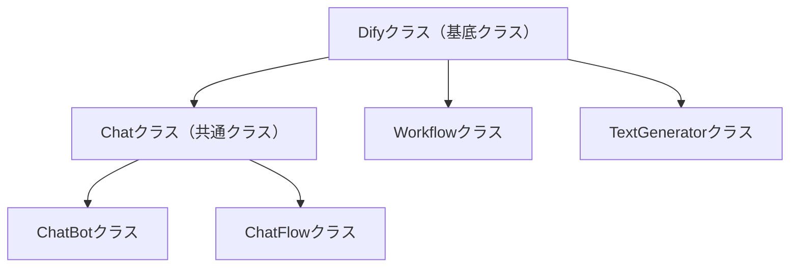

# DAS（Dify Application Script）要件定義書

## 1. プロジェクト概要

### 1.1 目的と範囲

- **目的**：Google Apps Script（GAS）から Dify API を簡単に呼び出すためのライブラリの作成
- **スコープ**：Dify Application Script（DAS）ライブラリの実装
- **対象 API**：Dify API v1（Chatbot、Chatflow、Workflow、TextGenerator）

### 1.2 技術スタック

- **実行環境**：Google Apps Script（V8 ランタイム）
- **言語**：JavaScript（ES6 互換）
- **HTTP 通信**：UrlFetchApp（GAS 標準ライブラリ）
- **認証**：Bearer Token（Dify API Key）
- **開発ツール**：clasp（Google Apps Script CLI）
- **対象 API**：Dify API v1

## 2. システム設計

### 2.1 クラス関係図



### 2.2 クラス設計

#### 2.2.1 Dify クラス（基底クラス）

- **役割**：すべての Dify サービスで共通する機能を提供する基底クラス
- **入力**：API Key、Base URL（オプション）
- **主要機能**：
  - API 認証の管理
  - 共通 HTTP リクエスト処理
  - エラーハンドリング
  - レスポンス解析
- **出力**：各種 Dify サービスへの統一されたアクセス

#### 2.2.2 Chat クラス（共通クラス）

- **役割**：ChatBot と Chatflow クラスの共通機能を提供
- **継承元**：Dify クラス
- **主要機能**：ストリーミングモード以外のチャット系共通処理

#### 2.2.3 ChatBot クラス

- **役割**：Dify のチャットボット機能へのアクセス
- **継承元**：Chat クラス
- **入力**：メッセージ、ユーザー ID、会話 ID（オプション）
- **主要機能**：
  - チャットメッセージ API（`/chat-messages`）の呼び出し
  - 会話管理
  - ブロッキング/ストリーミングモード対応
- **出力**：チャットボットからの応答メッセージ

#### 2.2.4 ChatFlow クラス

- **役割**：Dify のチャットフロー機能へのアクセス
- **継承元**：Chat クラス
- **入力**：入力パラメータ、ユーザー ID、会話 ID（オプション）
- **主要機能**：
  - チャットフロー API 呼び出し
  - フロー実行管理
  - 応答モード制御
- **出力**：チャットフロー実行結果

#### 2.2.5 Workflow クラス

- **役割**：Dify のワークフロー機能へのアクセス
- **継承元**：Dify クラス
- **入力**：入力パラメータ、ユーザー ID
- **主要機能**：
  - ワークフロー実行 API（`/workflows/run`）の呼び出し
  - 実行状態管理
  - 結果取得
- **出力**：ワークフロー実行結果

#### 2.2.6 TextGenerator クラス

- **役割**：Dify のテキスト生成機能へのアクセス
- **継承元**：Dify クラス
- **入力**：入力パラメータ、ユーザー ID
- **主要機能**：
  - テキスト完了 API（`/completion-messages`）の呼び出し
  - 生成パラメータ管理
  - 出力制御
- **出力**：生成されたテキスト

## 3. プロジェクト構造

```
/workspace/
├── main.js              # メインライブラリファイル
├── appsscript.json      # GASプロジェクト設定
├── 要件定義書.md        # プロジェクト要件定義
├── タスクリスト.md        # 開発作業計画
├── README.md            # プロジェクト説明
├── CLAUDE.md            # Claude設定ファイル
├── dify-api/            # APIリファレンス
│   ├── chatbot/         # チャットボットAPI仕様
│   ├── チャットフロー/  # チャットフローAPI仕様
│   ├── ワークフロー/    # ワークフローAPI仕様
│   └── テキストジェネレーター/ # テキスト生成API仕様
├── tests/               # テストファイル（予定）
└── example.js            # 使用例（予定）
```

## 4. API 仕様

### 4.1 認証方式

- Authorization: Bearer {API_KEY}
- Content-Type: application/json

### 4.2 主要エンドポイント

- チャット: `/chat-messages`
- ワークフロー: `/workflows/run`
- テキスト完了: `/completion-messages`
- 会話履歴: `/conversations`

### 4.3 レスポンス形式

- JSON 形式
- メタデータ（使用量、価格情報）を含む
- エラー時は適切なステータスコードとメッセージ

## 5. 制約・条件

### 5.1 技術的制約

- Google Apps Script 環境で動作すること
- ES6 互換の JavaScript で実装
- Dify API v1 に対応
- UrlFetchApp を使用した HTTP 通信

### 5.2 パフォーマンス要件

- API 呼び出し時のタイムアウト処理
- 適切なエラーハンドリング
- レスポンス時間の最適化

### 5.3 セキュリティ要件

- API Key の安全な管理
- HTTPS による暗号化通信
- 入力値のバリデーション
- エラー情報の適切な処理

## 6. 開発環境・ツール

### 6.1 プロジェクト概要

**DAS (Dify Application Script)**

- Google Apps Script ライブラリプロジェクト
- 作業ディレクトリ: `/workspace`
- プロジェクト機能：
  1. Google Apps Script（GAS）から Dify API を簡単に呼び出すためのライブラリ
  2. Chatbot、Chatflow、Workflow、TextGenerator の各機能に対応
  3. 統一されたインターフェースで Dify サービスへアクセス可能

### 6.2 開発コマンド

```bash
clasp push    # Google Cloudに反映
clasp pull    # Cloudから取得
clasp open    # Apps Scriptエディタで開く
clasp create [scriptTitle] # 新しい Apps Script プロジェクトを作成する
```
